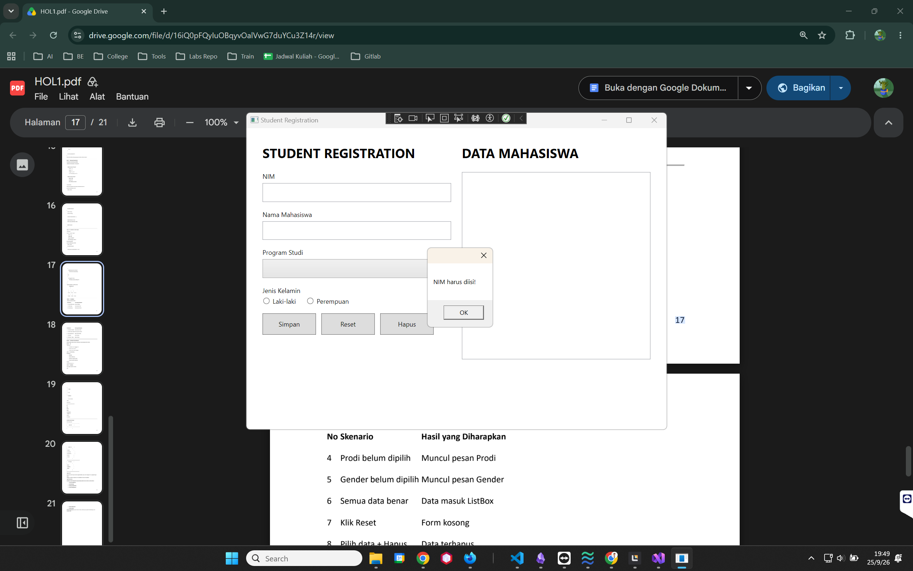
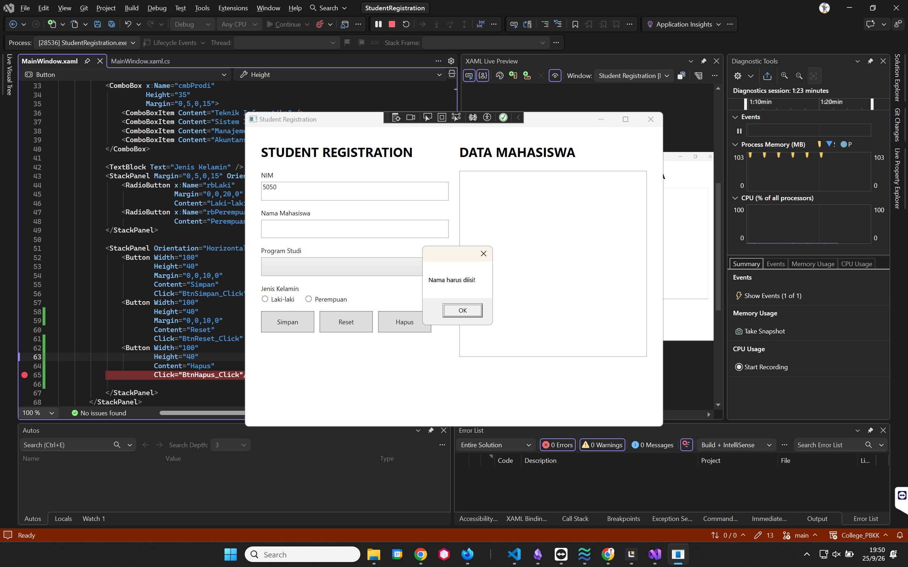
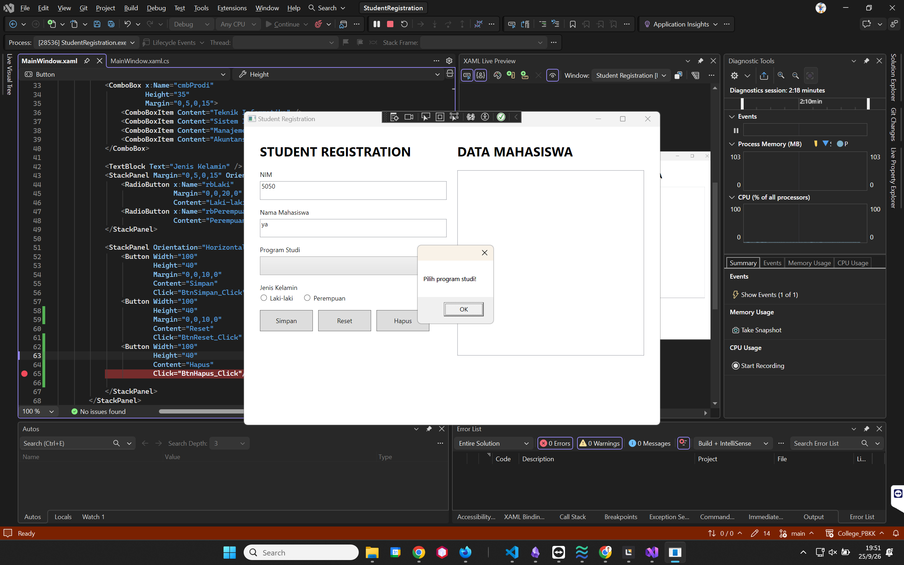
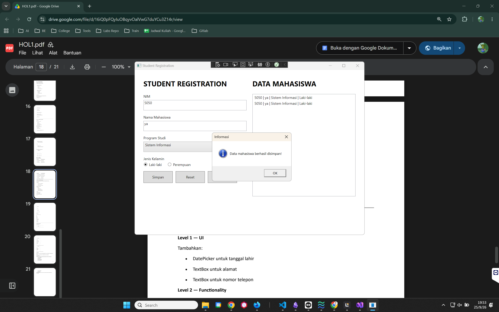
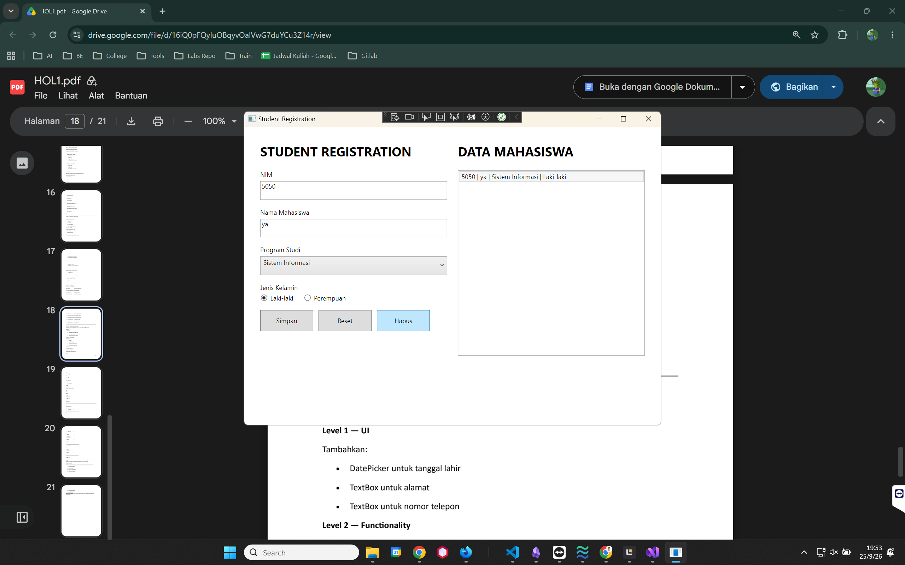

# Student Registration App

Aplikasi desktop **Student Registration App** dibuat menggunakan Windows Presentation Foundation (WPF). Aplikasi ini menerapkan fitur CRUD secara in-memory untuk mengelola data mahasiswa, meliputi **Simpan, Edit, Hapus, Cari, dan Reset**.

## Test Case

### 1. NIM kosong

**Hasil yang diharapkan:** Muncul pesan bahwa NIM harus diisi.

### 2. Nama kosong

**Hasil yang diharapkan:** Muncul pesan bahwa nama harus diisi.

### 3. Program studi belum dipilih

**Hasil yang diharapkan:** Muncul pesan untuk memilih program studi.

### 4. Gender belum dipilih

**Hasil yang diharapkan:** Muncul pesan untuk memilih jenis kelamin.

### 5. Semua data benar

**Hasil yang diharapkan:** Data mahasiswa berhasil masuk ke dalam ListBox.

### 6. Klik Reset

**Hasil yang diharapkan:** Seluruh isian form kembali kosong.

### 7. Pilih data dan klik Hapus

**Hasil yang diharapkan:** Data yang dipilih terhapus dari ListBox.

