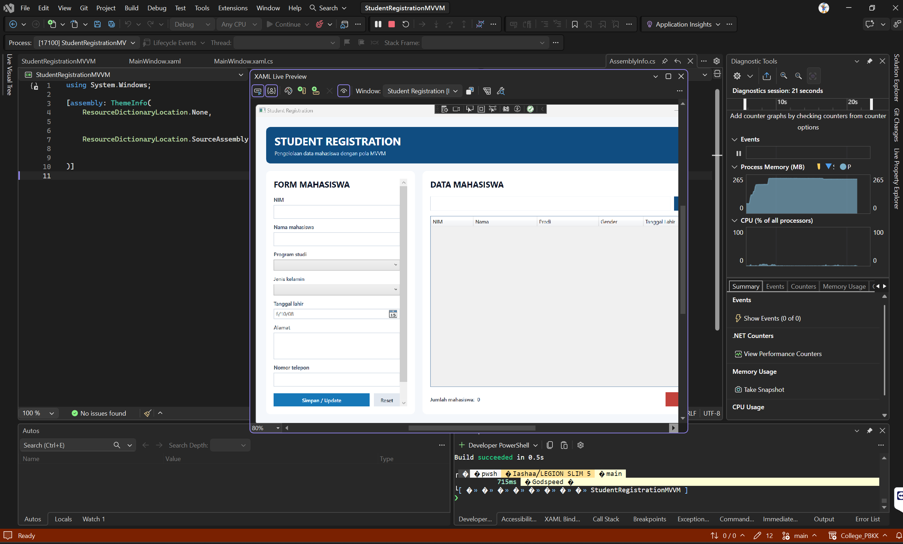

# Student Registration MVVM

Nama: Hartmann Kanisius Galla' Massang  
NRP: 5025241160

Student Registration MVVM adalah aplikasi desktop untuk mengelola data mahasiswa yang dibuat menggunakan C# dan WPF di Visual Studio. Aplikasi menerapkan pola **Model-View-ViewModel (MVVM)** agar tampilan, logika aplikasi, dan akses database memiliki tanggung jawab yang terpisah.

Data mahasiswa disimpan dalam database MySQL menggunakan package `MySqlConnector`.

## Hasil aplikasi



## Fitur aplikasi

### 1. Menambah data mahasiswa

Pengguna dapat mengisi data mahasiswa melalui form yang tersedia, yaitu:

- NIM
- Nama mahasiswa
- Program studi
- Jenis kelamin
- Tanggal lahir
- Alamat
- Nomor telepon

Sebelum disimpan, data akan divalidasi terlebih dahulu. NIM harus terdiri dari 8 sampai 12 digit angka, nama minimal 3 karakter, usia mahasiswa minimal 15 tahun, alamat minimal 5 karakter, dan nomor telepon harus diawali `08` atau `628`. Aplikasi juga memastikan NIM tidak digunakan oleh mahasiswa lain.

### 2. Mencari data mahasiswa

Data mahasiswa dapat dicari berdasarkan **NIM, nama, atau program studi**. Masukkan kata kunci pada kolom pencarian, kemudian klik tombol **Cari** untuk menampilkan data yang sesuai.

### 3. Mengubah data mahasiswa

Pilih salah satu baris pada tabel mahasiswa. Data yang dipilih akan otomatis ditampilkan pada form di sebelah kiri. Setelah data diubah, klik tombol **Simpan / Update** untuk menyimpan perubahan.

### 4. Menghapus data mahasiswa

Pilih data mahasiswa pada tabel, kemudian klik tombol **Hapus**. Data yang dipilih akan dihapus dari database dan daftar mahasiswa akan dimuat ulang.

### 5. Menyimpan data ke MySQL

Semua data yang ditambahkan atau diubah disimpan ke database MySQL sehingga tetap tersedia ketika aplikasi dibuka kembali. Seluruh query menggunakan parameter untuk menghindari penggabungan langsung input pengguna ke dalam SQL.

## Teknologi yang digunakan

- C#
- .NET 10
- Windows Presentation Foundation (WPF)
- Pola arsitektur MVVM
- MySQL
- `MySqlConnector` 2.6.2
- Visual Studio

## Cara menjalankan aplikasi

### 1. Menyiapkan kebutuhan

Pastikan perangkat telah memiliki:

- Windows
- [.NET 10 SDK](https://dotnet.microsoft.com/download/dotnet/10.0)
- Visual Studio dengan workload **.NET desktop development**, atau editor lain yang mendukung proyek .NET
- MySQL Server

### 2. Menyiapkan database

Pastikan MySQL sedang berjalan, kemudian jalankan isi file [`schema.sql`](code/StudentRegistrationMVVM/StudentRegistrationMVVM/schema.sql) melalui MySQL Workbench atau aplikasi database lainnya.

File tersebut akan:

1. Membuat database `student_db` jika belum tersedia.
2. Membuat tabel `mahasiswa` jika belum tersedia.
3. Menambahkan constraint `UNIQUE` pada NIM agar tidak ada NIM duplikat.

Struktur tabel yang digunakan adalah sebagai berikut:

| Kolom | Tipe data | Keterangan |
|---|---|---|
| `id` | `INT` | ID otomatis dan primary key |
| `nim` | `VARCHAR(20)` | NIM mahasiswa, wajib diisi, dan unik |
| `nama` | `VARCHAR(100)` | Nama mahasiswa |
| `prodi` | `VARCHAR(50)` | Program studi |
| `jenis_kelamin` | `VARCHAR(20)` | Jenis kelamin |
| `tanggal_lahir` | `DATE` | Tanggal lahir |
| `alamat` | `VARCHAR(255)` | Alamat mahasiswa |
| `no_telepon` | `VARCHAR(20)` | Nomor telepon |

### 3. Mengatur koneksi database

Konfigurasi bawaan aplikasi berada di [`MahasiswaRepository.cs`](code/StudentRegistrationMVVM/StudentRegistrationMVVM/Data/MahasiswaRepository.cs) dengan connection string berikut:

```text
Server=localhost;Port=3306;Database=student_db;User ID=root;Password=;
```

Jika username, password, port, atau nama database berbeda, gunakan environment variable `STUDENT_DB_CONNECTION_STRING` agar kredensial tidak perlu disimpan di source code.

Contoh menggunakan PowerShell:

```powershell
$env:STUDENT_DB_CONNECTION_STRING = "Server=localhost;Port=3306;Database=student_db;User ID=root;Password=password_kamu;"
```

### 4. Menjalankan project

Project dapat dibuka melalui file [`StudentRegistrationMVVM.slnx`](code/StudentRegistrationMVVM/StudentRegistrationMVVM.slnx) di Visual Studio, kemudian dijalankan dengan tombol **Start** atau `F5`.

Project juga dapat dijalankan dari terminal pada folder `code/StudentRegistrationMVVM`:

```powershell
dotnet restore
dotnet run --project StudentRegistrationMVVM/StudentRegistrationMVVM.csproj
```

Jika MySQL belum aktif atau schema belum dibuat, jendela aplikasi tetap terbuka dan pesan kesalahan koneksi ditampilkan pada bagian bawah form.

## Struktur project

```text
pertemuan5/
|-- image.png
|-- README.md
`-- code/
    `-- StudentRegistrationMVVM/
        |-- StudentRegistrationMVVM.slnx
        `-- StudentRegistrationMVVM/
            |-- Data/
            |   `-- MahasiswaRepository.cs
            |-- Models/
            |   `-- Mahasiswa.cs
            |-- ViewModels/
            |   |-- MahasiswaViewModel.cs
            |   `-- RelayCommand.cs
            |-- App.xaml
            |-- MainWindow.xaml
            |-- MainWindow.xaml.cs
            |-- schema.sql
            `-- StudentRegistrationMVVM.csproj
```

## Penjelasan kode

### `MainWindow.xaml`

File [`MainWindow.xaml`](code/StudentRegistrationMVVM/StudentRegistrationMVVM/MainWindow.xaml) merupakan **View** yang mengatur tampilan aplikasi dan binding data. File ini berisi:

- Form input data mahasiswa.
- `TextBox` untuk NIM, nama, alamat, dan nomor telepon.
- `ComboBox` untuk program studi dan jenis kelamin.
- `DatePicker` untuk tanggal lahir.
- Tombol **Simpan / Update**, **Reset**, **Cari**, dan **Hapus**.
- `DataGrid` read-only untuk menampilkan daftar mahasiswa.
- Informasi jumlah mahasiswa dan pesan status.

Komponen pada View terhubung ke property dan command di ViewModel menggunakan data binding. Dengan cara ini, View tidak menjalankan proses CRUD secara langsung.

### `MainWindow.xaml.cs`

File [`MainWindow.xaml.cs`](code/StudentRegistrationMVVM/StudentRegistrationMVVM/MainWindow.xaml.cs) hanya menginisialisasi tampilan dan menetapkan `MahasiswaViewModel` sebagai `DataContext`. Logika aplikasi tidak ditempatkan di code-behind.

### `MahasiswaViewModel.cs`

File [`MahasiswaViewModel.cs`](code/StudentRegistrationMVVM/StudentRegistrationMVVM/ViewModels/MahasiswaViewModel.cs) menjadi penghubung antara View, model, dan repository. Class ini mengimplementasikan `INotifyPropertyChanged` agar perubahan data dapat langsung diperbarui pada UI.

Tanggung jawab utamanya meliputi:

- Menyimpan state form pada property `FormMahasiswa`.
- Menampilkan data melalui `ObservableCollection<Mahasiswa>`.
- Memuat dan mencari data melalui `LoadData()`.
- Menambah atau mengubah data melalui `SaveCommand`.
- Menghapus data melalui `DeleteCommand`.
- Mengosongkan form melalui `ResetCommand`.
- Mencari data melalui `SearchCommand`.
- Memvalidasi dan menormalisasi input sebelum disimpan.
- Menampilkan hasil operasi atau kesalahan melalui `StatusMessage`.

Ketika pengguna memilih baris pada tabel, data disalin ke `FormMahasiswa`. Dengan demikian, perubahan pada form tidak langsung mengubah isi tabel sebelum tombol **Simpan / Update** ditekan.

### `RelayCommand.cs`

File [`RelayCommand.cs`](code/StudentRegistrationMVVM/StudentRegistrationMVVM/ViewModels/RelayCommand.cs) mengimplementasikan interface `ICommand`. Class ini memungkinkan tombol pada View menjalankan method di ViewModel melalui command binding tanpa event handler di code-behind.

### `Mahasiswa.cs`

File [`Mahasiswa.cs`](code/StudentRegistrationMVVM/StudentRegistrationMVVM/Models/Mahasiswa.cs) merupakan **Model** yang merepresentasikan satu data mahasiswa. Property di dalamnya sesuai dengan kolom tabel `mahasiswa`, yaitu `Id`, `Nim`, `Nama`, `Prodi`, `JenisKelamin`, `TanggalLahir`, `Alamat`, dan `NoTelepon`.

### `MahasiswaRepository.cs`

File [`MahasiswaRepository.cs`](code/StudentRegistrationMVVM/StudentRegistrationMVVM/Data/MahasiswaRepository.cs) menangani koneksi dan operasi database. Method yang tersedia adalah:

- `GetAll()` untuk mengambil seluruh data atau mencari berdasarkan kata kunci.
- `Insert()` untuk menambahkan data mahasiswa.
- `Update()` untuk mengubah data mahasiswa.
- `Delete()` untuk menghapus data berdasarkan ID.
- `NimExists()` untuk memeriksa apakah NIM sudah digunakan.

Query menggunakan parameter seperti `@nim`, `@nama`, dan `@id`. Method `AddParameters()` digunakan untuk menambahkan parameter yang sama pada operasi insert dan update agar kode tidak ditulis berulang kali.

### `schema.sql`

File [`schema.sql`](code/StudentRegistrationMVVM/StudentRegistrationMVVM/schema.sql) berisi SQL untuk membuat database `student_db` dan tabel `mahasiswa`. Kolom `id` menggunakan `AUTO_INCREMENT`, sedangkan kolom `nim` menggunakan constraint `UNIQUE`.

## Alur aplikasi

```text
Pengguna mengisi atau memilih data pada View
                    |
                    v
View mengirim command ke MahasiswaViewModel
                    |
                    v
ViewModel memvalidasi dan menormalisasi data
                    |
                    v
MahasiswaRepository menjalankan query MySQL
                    |
                    v
ViewModel memuat ulang ObservableCollection
                    |
                    v
DataGrid pada View diperbarui melalui binding
```

Pembagian ini membuat `MainWindow.xaml` fokus pada tampilan, `MahasiswaViewModel.cs` menangani state dan aksi pengguna, `Mahasiswa.cs` merepresentasikan data, dan `MahasiswaRepository.cs` menangani komunikasi dengan MySQL.

## Referensi

- [Dokumentasi WPF .NET](https://learn.microsoft.com/dotnet/desktop/wpf/)
- [Pola MVVM pada aplikasi desktop .NET](https://learn.microsoft.com/dotnet/architecture/maui/mvvm)
- [Dokumentasi MySQL](https://dev.mysql.com/doc/)
- [Dokumentasi MySqlConnector](https://mysqlconnector.net/)
