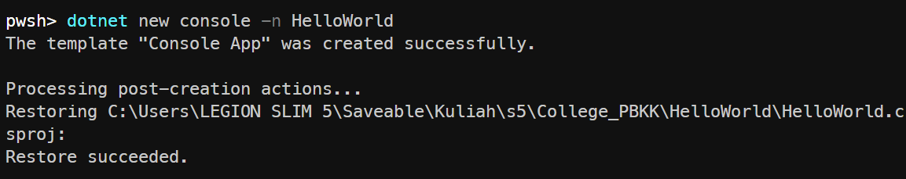

| Keterangan  | Detail                              |
| ----------- | ----------------------------------- |
| Nama       | Hartmann Kanisius Galla' Massang                  |
| NRP    | 5025241160              |
| Prodi       | Teknik Informatika                  |
| Mata Kuliah | Pemrograman Berbasis Kerangka Kerja |
| Kelas       | D                                   |


# Program Hello World
Program ini merupakan program untuk mencetak teks "Hello, World!" menggunakan bahasa C# dan .NET.

## Setup Project Directory

1. **Inisialisasi project** dengan template `console`. Perintah ini otomatis membuat folder `HelloWorld` beserta file `HelloWorld.csproj` dan `Program.cs`.

   ```bash
   dotnet new console -n HelloWorld
   ```

   

2. **Masuk ke folder** project yang sudah dibuat, lalu jalankan programnya.

   ```bash
   cd HelloWorld
   dotnet run
   ```

   Perintah `dotnet run` sekaligus mengompilasi dan menjalankan program, tanpa perlu build terpisah.

   

