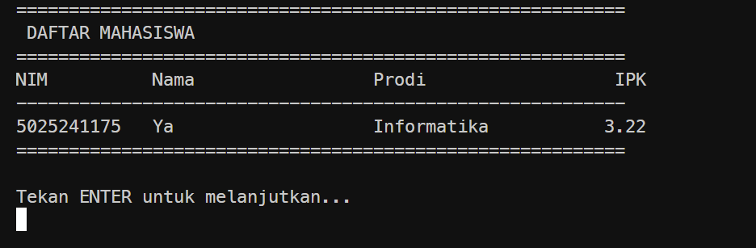

# Sistem Data Mahasiswa

Aplikasi console sederhana menggunakan C# dan .NET untuk mengelola data mahasiswa.

## Fitur

* Tambah mahasiswa
* Tampilkan daftar mahasiswa
* Cari mahasiswa berdasarkan NIM
* Hapus mahasiswa berdasarkan NIM
* Validasi IPK antara 0 sampai 4

## Struktur Project

```text
sistem-data-mahasiswa/
├── Models/
│   └── Mahasiswa.cs
├── Services/
│   └── MahasiswaService.cs
├── Program.cs
├── README.md
└── sistem-data-mahasiswa.csproj
```

### Models/Mahasiswa.cs

Berisi model data mahasiswa dengan atribut:

* NIM
* Nama
* Program Studi
* IPK

### Services/MahasiswaService.cs

Berisi logic pengelolaan data mahasiswa:

* Menambah mahasiswa
* Mengambil seluruh mahasiswa
* Mencari mahasiswa
* Menghapus mahasiswa

### Program.cs

Berisi bagian utama aplikasi console:

* Menu utama
* Input pengguna
* Menampilkan data
* Menghubungkan input pengguna dengan `MahasiswaService`

## Membuat Project

```bash
dotnet new console -n sistem-data-mahasiswa
cd sistem-data-mahasiswa
```

Buat folder:

```bash
mkdir Models
mkdir Services
```

Kemudian tambahkan file sesuai struktur project.

## Menjalankan Program

```bash
dotnet run
```

Program akan menampilkan menu:

```text
========================================
 SISTEM DATA MAHASISWA
========================================
1. Tambah Mahasiswa
2. Tampilkan Mahasiswa
3. Cari Mahasiswa
4. Hapus Mahasiswa
5. Keluar
========================================
```

## Contoh Data



Kemudian data dapat ditampilkan melalui menu **Tampilkan Mahasiswa**.

## Teknologi

* C#
* .NET
* Console Application

## Konsep yang Digunakan

Project ini menggunakan beberapa konsep dasar Object-Oriented Programming:

* Class
* Object
* Property
* Constructor
* Encapsulation sederhana
* Pemisahan model, service, dan application logic
* Generic Collection `List<T>`

Data masih disimpan di dalam memory menggunakan `List<Mahasiswa>`, sehingga data akan hilang ketika program dihentikan.
